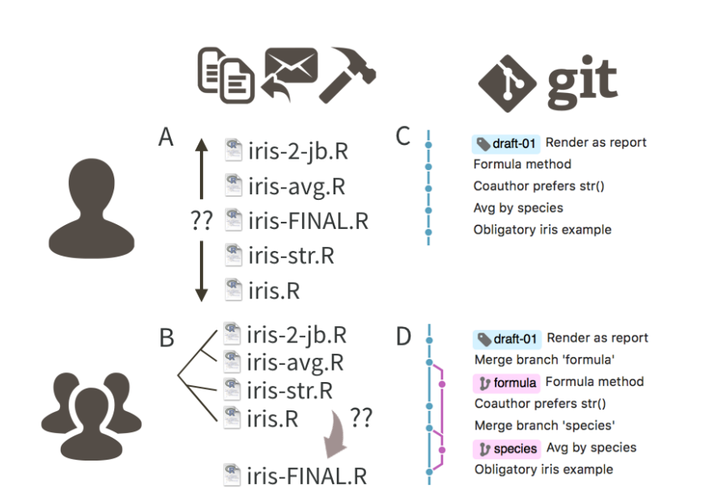
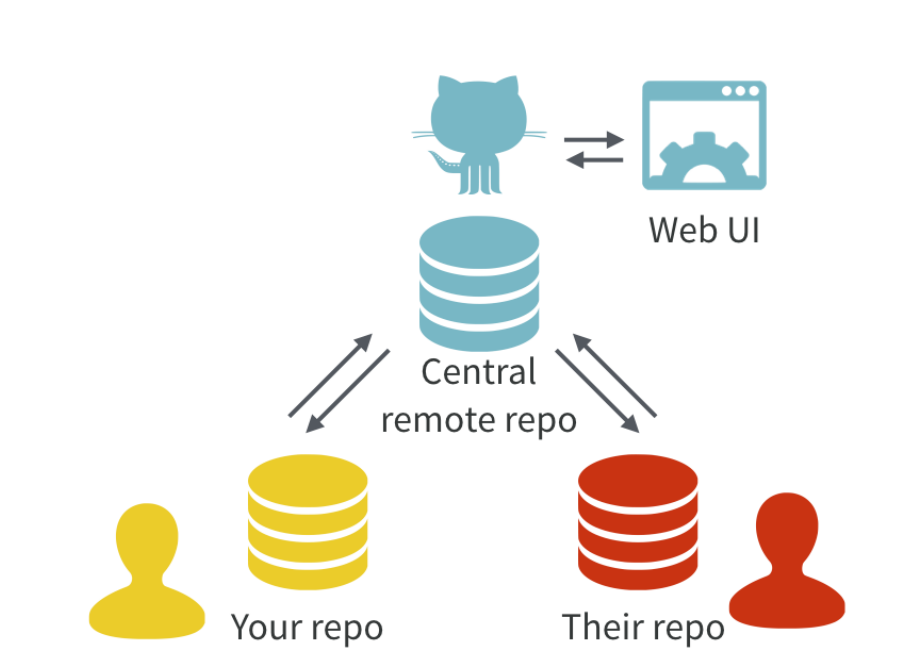
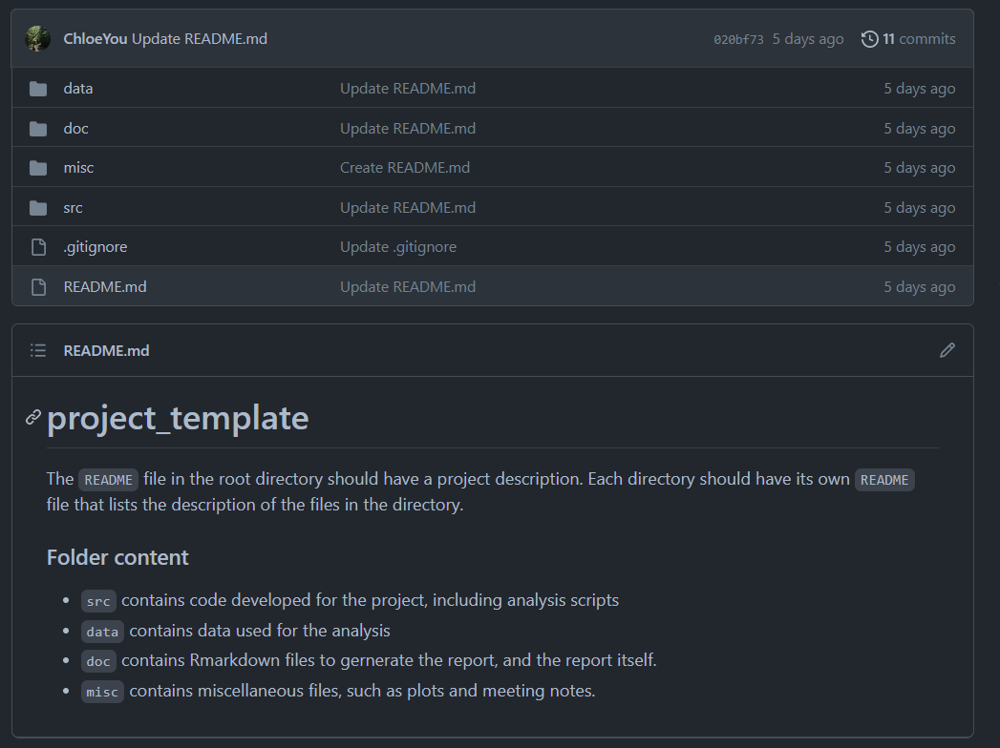
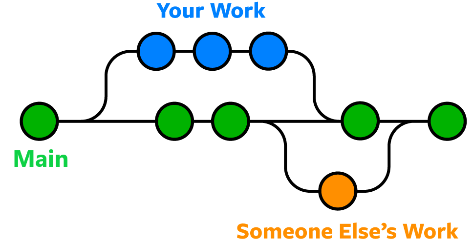

```{r setup, include=FALSE}
knitr::opts_chunk$set(echo = TRUE)
library(palmerpenguins)
library(tidyverse)
theme_set(theme_classic())
pgs <- penguins %>% drop_na()
```


## Welcome!

Today, we are learning about git and GitHub.

## Version control with git and GitHub[^*]

- git is a version control system that tracks and manages changes to software code

{width=50%}

[^*]:Excuse me, do you have a moment to talk about version control? Bryan, J. (2017)

## Cloud storing with GitHub[^*]

- GitHub is a cloud-based storage site (like Google Drive)

{width=50%}

[^*]:Excuse me, do you have a moment to talk about version control? Bryan, J. (2017)

## Why GitHub?

>- Focus on code makes it more powerful than other cloud-hosting services
>- GitHub issues for discussion
>- Makes collaboration super easy
>- Makes sharing your projects with the world super easy
>- Admin control over repos and organizations
>- GitHub pages to create and host websites
>- There are other alternatives (e.g., Bitbucket, GitLab)


## Popular git commands

>- `git clone` to copy a repo from GitHub to your computer for the first time
>- `git pull` to download changes from GitHub to your computer
>- `git add` to locally stage your changes
>- `git commit` to locally save your changes
>- `git push` to upload your local commits to GitHub
>- Other commands: `git status`, `git checkout`, `git merge`

## How to organize your repo

>- Generally, repos should be stand-alone piece of work
>- You might want to split some projects into multiple repos (e.g., software and research paper)
>- For STAT 450, all work will be in a single repo
>- **Use `README.md` files**. They make your repo readable!

## How to organize your repo

A good structure for your repo is usually:

{width=60%}

Subdirectories (within reason) should have a `README.md` file too!

## Working on branches

- Branching means you diverge from the main line of development and continue 
to do work without messing with that main line.[^1]

{width=60%}

[^1]:https://www.nobledesktop.com/learn/git/git-branches

## Merge conflicts

- Conflicts generally arise when two people have changed the same lines in a file, 
or if one person deleted a file while another person was modifying it.[^2]

- Demo: branching, resolving merge conflict, creating a pull request, some git commands


[^2]:https://www.atlassian.com/git/tutorials/using-branches/merge-conflicts


## Now your turn!

1. Create a new branch in your project repo
2. Clone it to your computer
3. Add your client meeting notes from this morning to the `misc`
4. Stage, commit with a message, and push your changes to your branch
5. Add a description of your file in the README.md file in the `misc` directory on your branch
6. Stage, commit with a message, and push your changes to your branch
7. On Github, create a pull request to the main branch and assign one of your teammates for review.
8. Copy the pull request link and submit it to Canvas under assignments `Lab 3`. 
9. Your teammate should review it and merge the branch into main. 
You might need to work in groups to resolve merge conflicts, but it's a good exercise!


