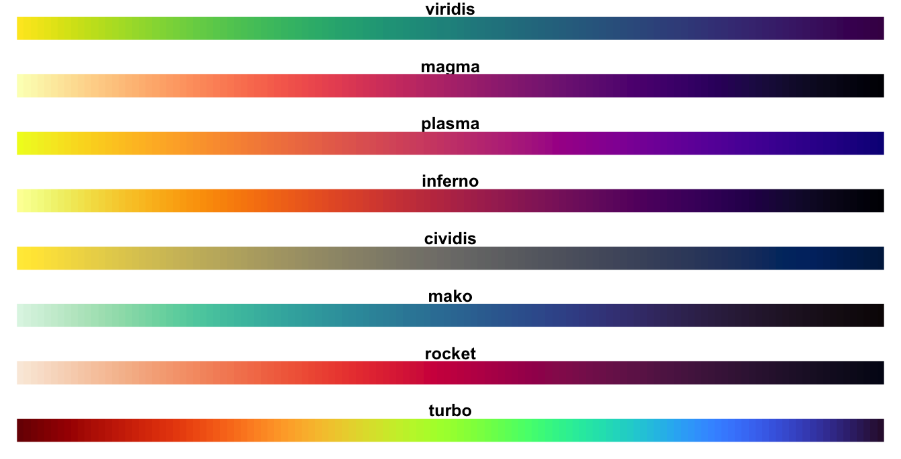
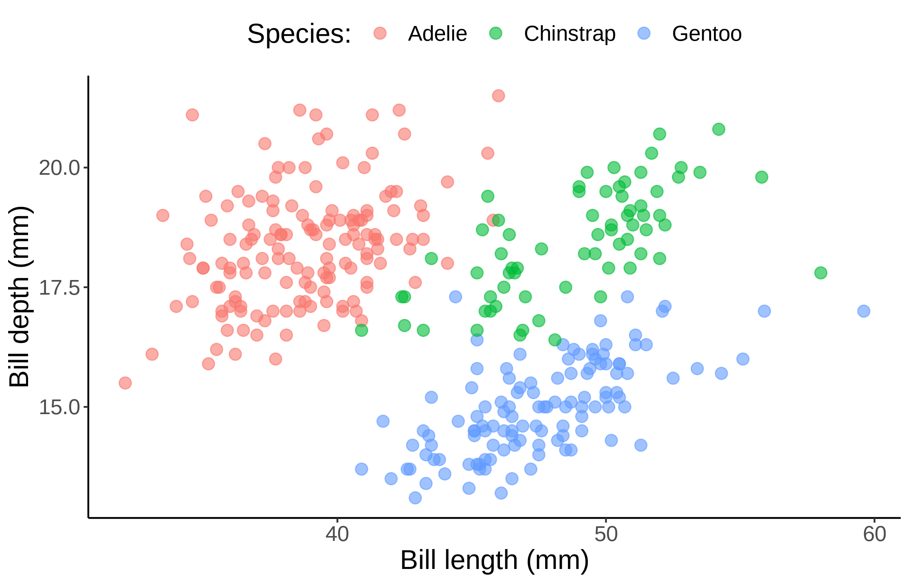
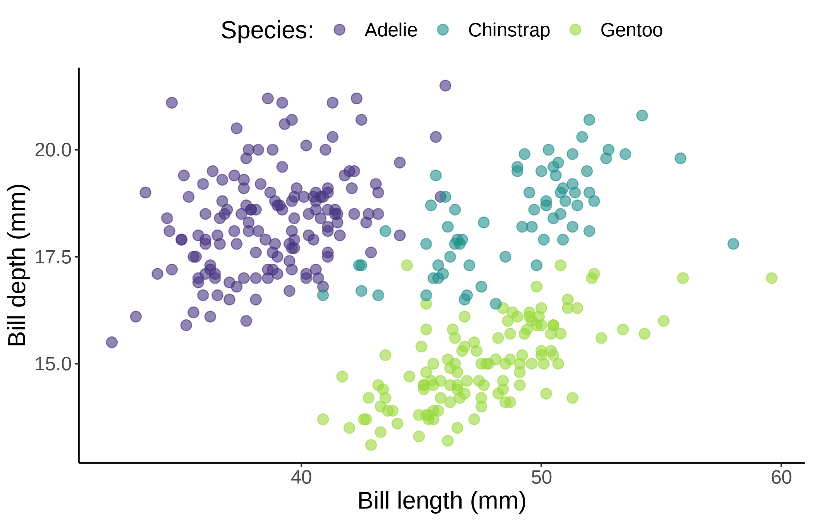
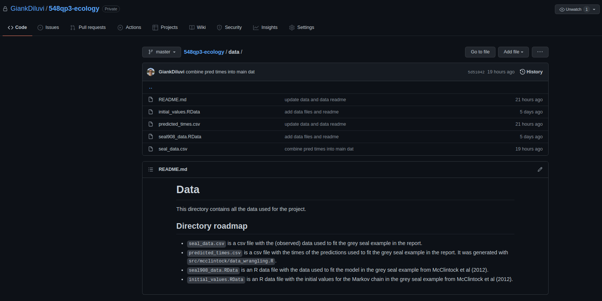

```{r setup, include=FALSE}
knitr::opts_chunk$set(echo = TRUE)
library(palmerpenguins)
library(tidyverse)
theme_set(theme_classic())
pgs <- penguins %>% drop_na()
```


## Welcome!

Today, we are learning about git and GitHub.

## Color blind friendly palettes

>- Colors are a great way to show patterns in visualizations
>- But default palettes are seldom friendly to color blind people
>- Solution: viridis (and friends)
>- Add them to ggplots by using `scale_color_viridis_d` (or `_c` for continuous axes)

## Color blind friendly palettes

- Colors are a great way to show patterns in visualizations
- But default palettes are seldom friendly to color blind people
- Solution: viridis (and friends)
- Add them to ggplots by using `scale_color_viridis_d` (or `_c` for continuous axes)

{width=50%}

## Viridis example

```{r}
plot <- pgs %>% 
  ggplot(aes(x = bill_length_mm, bill_depth_mm, color = species)) +
  geom_point(size = 3, alpha = 0.6) +
  labs(x = "Bill length (mm)",
       y = "Bill depth (mm)",
       color = "Species:") +
  theme(legend.position = "top",
        text = element_text(size=16))
```


## Viridis example

```{r, eval=FALSE}
plot
```

{width=65%}

## Viridis example

```{r, eval=FALSE}
plot+scale_color_viridis_d(begin = 0.15, end = 0.85)
```

{width=65%}

## Version control with git and GitHub

- git is a version control system (think Word's track changes)


(Excuse me, do you have a moment to talk about version control? Bryan, J. (2017))

## Cloud storing with GitHub

- GitHub is a cloud-based storage site (think Google Drive)


(Excuse me, do you have a moment to talk about version control? Bryan, J. (2017))

## Why GitHub?

>- Focus on code makes it more powerful than other cloud-hosting services
>- GitHub issues for discussion
>- Makes collaboration super easy
>- Makes sharing your projects with the world super easy
>- Admin control over repos and organizations
>- GitHub pages to create and host websites
>- There are other alternatives (e.g., Bitbucket, GitLab)


## Popular git commands

>- `git clone` to copy a repo from GitHub to your computer for the first time
>- `git pull` to download changes from GitHub to your computer
>- `git add` to locally stage your changes
>- `git commit` to locally save your changes
>- `git push` to upload your local commits to GitHub
>- Other commands: `git status`, `git checkout`, `git merge`


## Using git in practice

>- git does not have a graphic interface
>- You can access git through the terminal (flexible but not user-friendly)
>- RStudio has git integration (user-friendly but not too flexible)
>- There are git-specific GUIs (user-friendly and flexible, but ymmv)
>- Most popular options: GitKraken and SourceTree


## How to organize your repo

>- Generally, repos should be stand-alone piece of work
>- You might want to split some projects into multiple repos (e.g., software and research paper)
>- For STAT 450, all work will be in a single repo
>- **Use `README.md` files**. They make your repo readable!

## How to organize your repo

A good structure for your repo is usually:

{width=80%}


## How to organize your repo

Subdirectories (within reason) should have a `README.md` file too!

{width=90%}


## Demo


## Now your turn!

1. Create a new repo (initialize with a README.md file, no gitignore, no license)
2. Clone it to your computer
3. Reproduce your final plot from the previous lab in an R script, and call it `lab2.R`

(*Hint:* `pgs <- penguins %>% drop_na()`)

4. Stage, commit, and push your changes to your repo
5. Add a description of your analysis in the README.md file
6. Stage, commit, and push your changes to your repo

7. Clone the stat450 repo (https://github.com/UBC-STAT/stat-450)

You can now download material for each new lab by doing `git pull`!

8. Clone the repo of your STAT 450 project so you have it locally
9. Open a new issue in your STAT 450 project repo on GitHub (title = your name, body = introduce yourself to your teammates)

